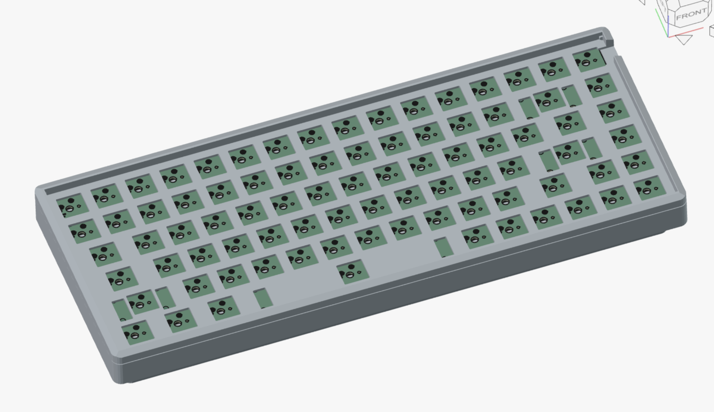
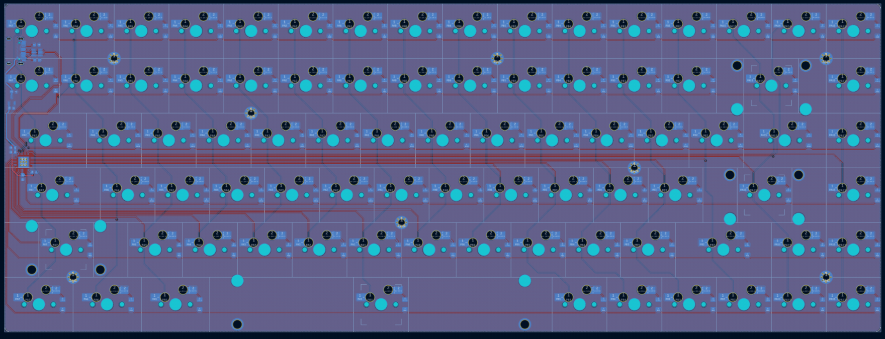
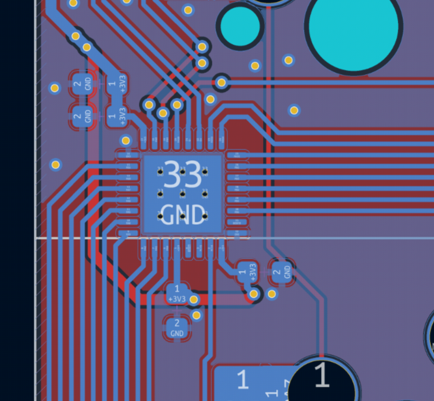
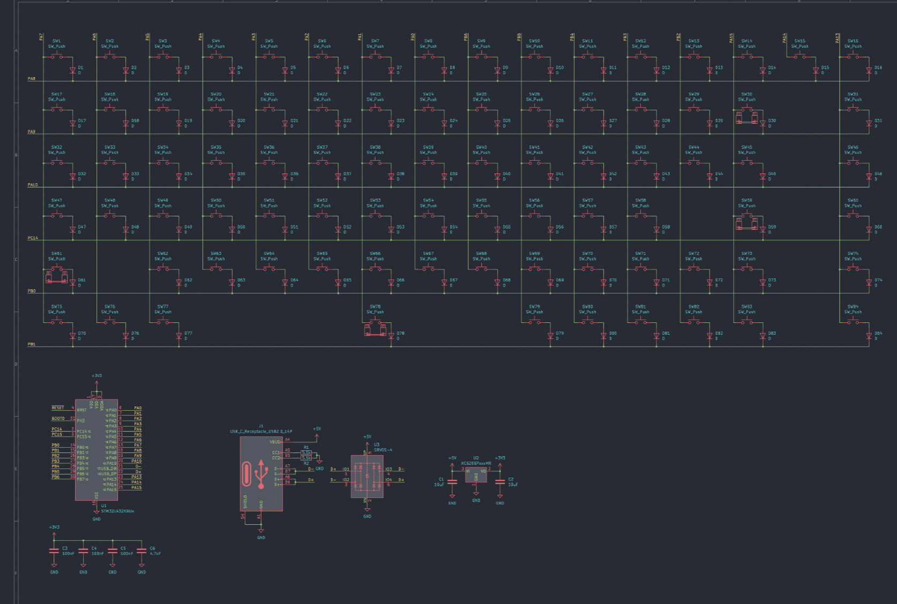

# Keycheron K2 clone

A clone of the keycheron K2 keyboard. Compatible with all operating systems from Mac to Android to Windows. Hot-swappable allows to customize the typing experience without soldering, just pop them in and it’s done. The socket is compatible with almost all the MX style switches.

This keyboard is a tactile mechanical keyboard with convenient access to all the essential function keys and a super slim form.

- Number of Keys: 84 keys 
- Number of Multimedia Keys: 12 
- Layout: ANSI
- QMK
- Onboard MCU
- STM32
- Low-bom

The keyboard also had an low power stm32 mcu onboard, minimizing the footprint and allowing easy usage. it has a crystalless usb phy which allows lower bom costs.

It is also completely open source, made in kicad. Everything is open for taking in this repo. You can check out the source files in their respective folders.

| Item | Price | Link |
| ---- | ----- | -- |
| PCB | $50| https://jlcpcb.com/ |
| Componets w/ shipping| $30| https://www.lcsc.com/ |
| Keycaps| $20 | https://fr.aliexpress.com/item/1005008134662628.html |
| Switches w/ hotswap| $30 | https://fr.aliexpress.com/item/1005007208285151.html + https://fr.aliexpress.com/item/1005010545874869.html |
| Total | $140 | - |
